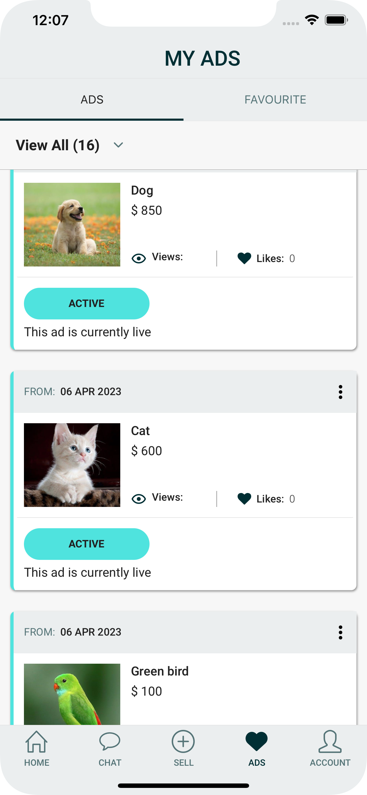
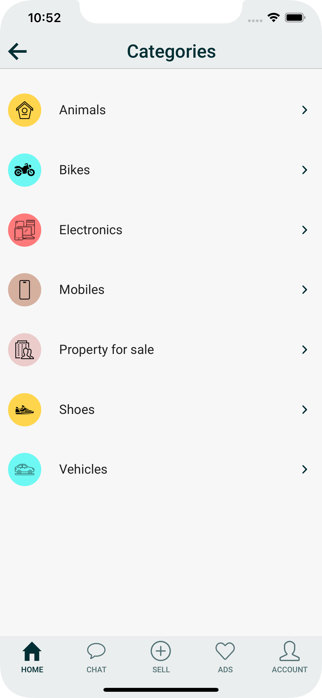
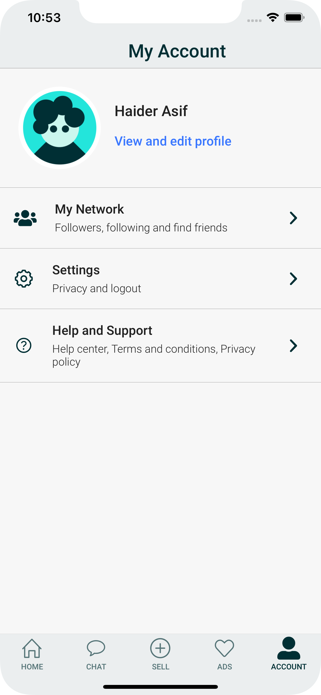
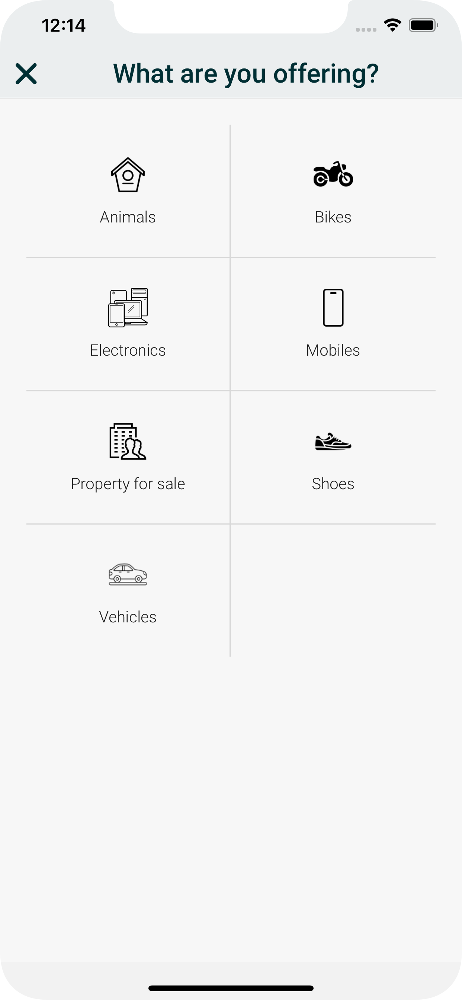
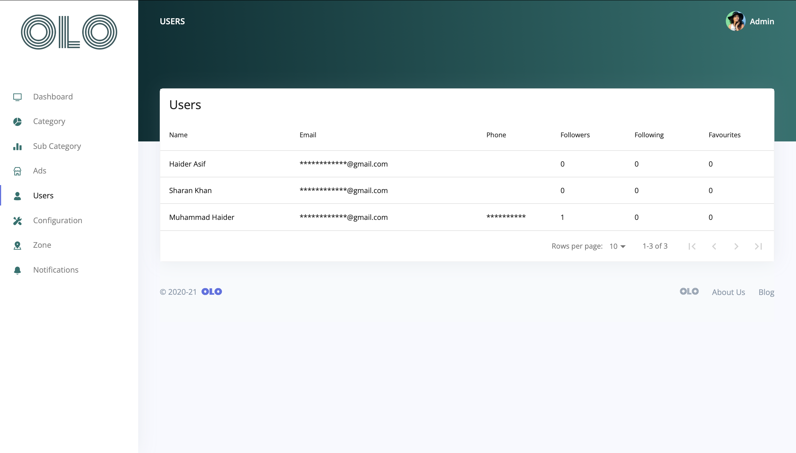
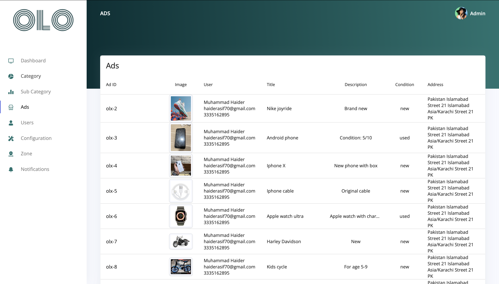

# OLO Mobile App

OLO Listing App is a full-fledge solution for having a listing solution for iOS, Android and Web for dashboard. We have made sure that you get a good design for mobile and dashboard application and a complete solution for you to easily implement this app for any restaurant application.
 
[React Native](https://github.com/facebook/react-native) with [Expo](https://expo.io/) is used to build this application for mobile end. For dashboard panel React has been used. Both mobile and web use [Graphql](https://graphql.org/). For State management and querying end points [Apollo Client](https://github.com/apollographql/apollo-client) is used. The API is made using [Node](https://nodejs.org/en/) with [Mongodb](https://www.mongodb.com/).

**Note: This is the full free source code of our solution, however the backend and API is proprietary and can be obtained via paid license.**

## What is included:

OLO app offers a comprehensive e-commerce solution with two distinct modules: the admin panel and the OLO app.

The admin panel lets you manage orders, track sales, and handle customer accounts efficiently. It's your command centre for complete control over your e-commerce business.

The OLO app provides a user-friendly platform for customers to customize and place their orders with ease. With a vast selection of products to choose from, customers can customize their orders to their liking, ensuring a hassle-free shopping experience.

## Features:

It has all the features that you will ever need to implement this application for any listing application. Some of the features that are included in it are:

- Push Notification for both Mobile and Web
- Email Integration -- Email is sent for some actions such as making Order
- Chat Integration
- Follow Integeration
- Google Authentication integration
- Mobile Responsive Dashboard
- Zones based ads shown
- Favourites Integration
   
  We have made sure that the code is well structured and removed of unnecessary screens to make your development life easier. It is also integrated with the following features so you could have an even better development experience.
   
- ESLint to provide you with linting capability in Javascript.
- Prettier for code formatting
- Jest for unit testing
- Husky to prevent bad commits.

## Setup

As we’ve mentioned above, the solution includes two separate modules. To setup these modules, follow the steps below:
To run the module, you need to have nodejs installed on your machine. Once nodejs is installed, go to the directory and enter the following commands: **npm start**
 
The required credentials and keys have been set already. You can setup your own keys and credentials
The version of nodejs should be between 16.0 to 18.0

## Screenshots

| OLO User Ads                      |              OLO Categories              |                           OLO Items |
| --------------------------------- | :--------------------------------------: | ----------------------------------: |
|  |  |  |

| OLO Items Detail                             |           OLO User Account            |                     OLO Sell Items |
| -------------------------------------------- | :-----------------------------------: | ---------------------------------: |
|  |  |  |

| Stats Overview                                 |             User Table             |                        Product Editing |
| ---------------------------------------------- | :--------------------------------: | -------------------------------------: |
|  |  |  |

## High Level Architecture

- User Mobile App communicates with only API Server
- Web dashboard communicates with only API Server

### Prerequisites:

**App Ids for Mobile App in app.json**

- iOS Client Id Google
- Android Id Google
- server url

**Set credentials in API in file helpers/config.js and helpers/credentials.js**

- Mongo User
- Mongo Password
- Mongo DB Name
- Reset Password Link
- Admin User name
- Admin Password
- User Id
- Name

**Set credentials in Admin Dashboard in file src/index.js**

- Firebase Api Key
- Auth Domain
- Database Url
- Project Id
- Storage Buck
- App Id

## Technologies

**Application program interface (API) server**

- NodeJS
- MongoDB
- ExpressJS
- Nodemailer
- Firebase(for push notification on web)
- Express GraphQL
- Mongoose(for mongodb)

**Web Dashboard**

- React
- GraphQL
- Bootstrap
- Firebase(for push notification on web)

**Mobile App**

- React Native
- Expo
- Graphql

## Download

<!--  -->

[Admin Dashboard](https://listing.ninjascode.com/)

## Documentation and Product Demo Video:

Find the link for the complete documentation of the OLO listing app [here](https://listing-nb.gitbook.io/olo-full-app/).

## Get the Latest News

## Reporting an issue

[Github Issues](https://github.com/Ninjas-Code-official/olxclone-backend/issues) are used to track todos, bugs, feature requests, and more.
Also check our [discord community](https://discord.gg/ef6PT6ZH). We'd like to help.

## Contributing

Are you a dev and would like to help? Found a bug that you would like to work on? Great! We have written down a [doc guide](https://listing-nb.gitbook.io/olo-full-app/) so you can start easily
